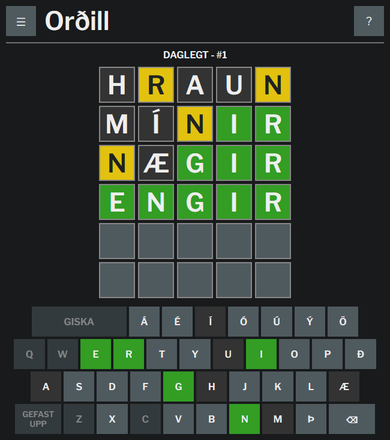

# Orðill (Icelandic Wordle)

An Icelandic implementation of the fantastic Wordle
(<https://www.powerlanguage.co.uk/wordle/>), made
for fun as I am learning Icelandic.

You can play a live version of this game here:
<https://t-veor.github.io/ordill/>



## Building

Run the following commands:

```
yarn install
yarn build
```

to build the project. The output files will be placed in `./dist/` - open the
`index.html` file in a browser to run.

## Dictionary

The word list is obtained from a processed version of Sigrúnarsnið, obtained
from Beygingarlýsing Íslensks Nútímamáls, distributed with CC BY-SA 4.0. The
processing script can be found at src/words/filter.py, which assumes that the
file SHSnid.csv is present in the same folder.
